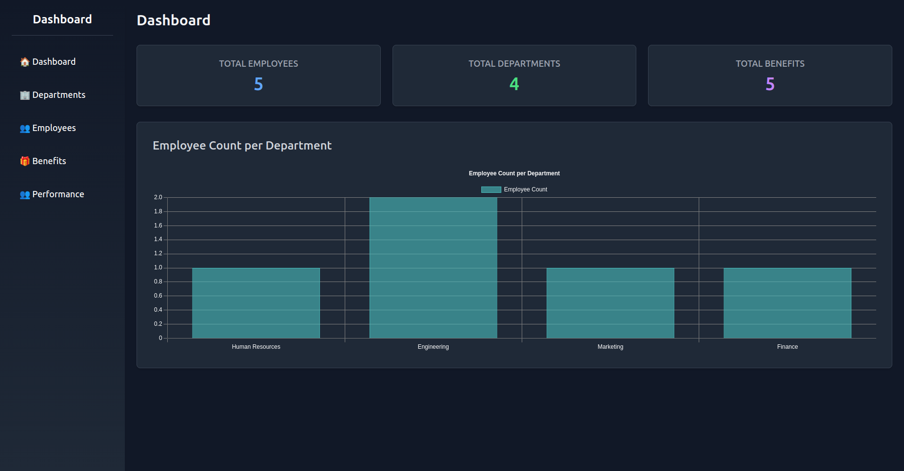
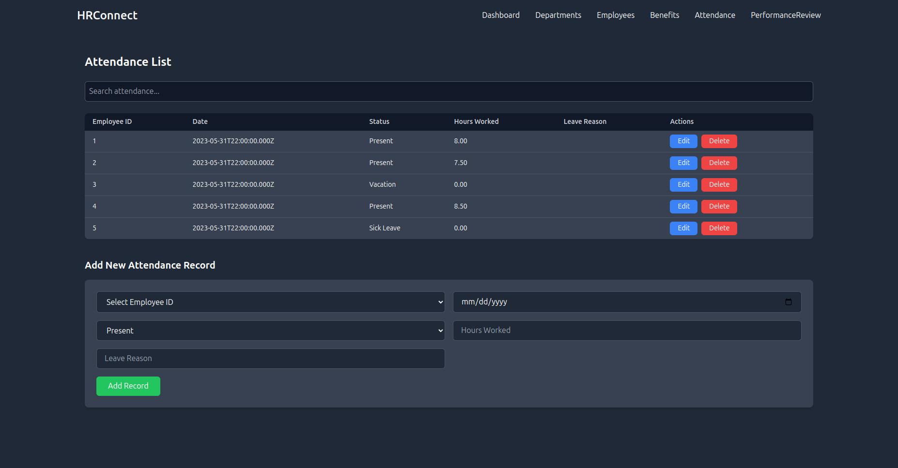
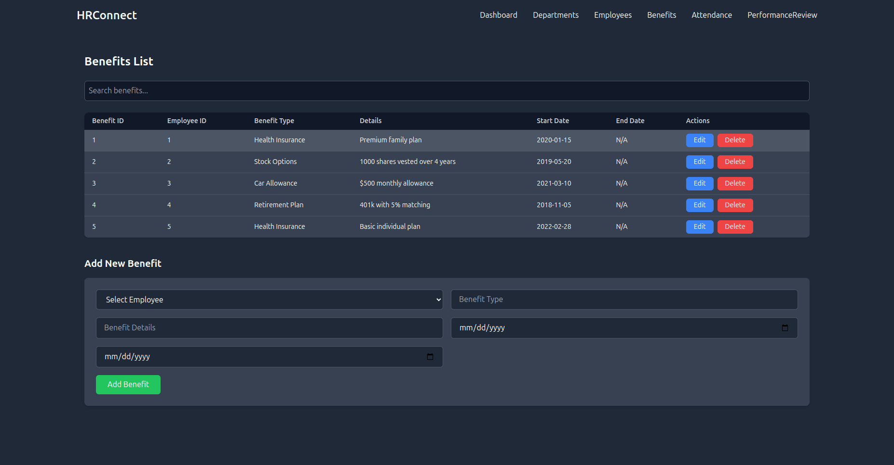
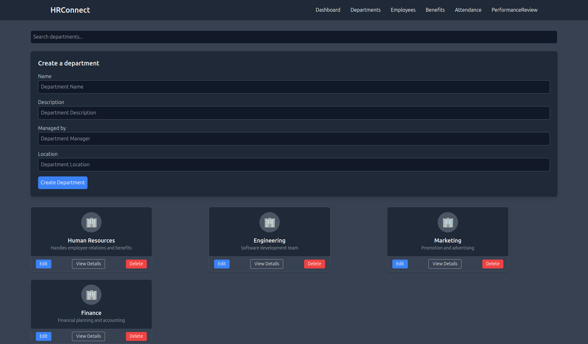

# Employee Management System  

A web-based application to manage employees, departments, and employee benefits efficiently. This project leverages **React**, **Node.js**, **PostgreSQL**, and **Tailwind CSS** to create a responsive and user-friendly system.

---

## Features  

- **Employee Management**: Add, edit, view, and delete employee details.  
- **Department Management**: Manage department details and assign employees.  
- **Benefits Tracking**: Track and manage employee benefits such as health insurance, PTO, and retirement plans.  
- **Responsive Design**: Built using Tailwind CSS for a mobile-friendly experience.  
- **Backend Integration**: Powered by Node.js with PostgreSQL as the database.

---

## Tech Stack  

### Frontend  
- React  
- Tailwind CSS  

### Backend  
- Node.js  
- Express.js  

### Database  
- PostgreSQL  

---
